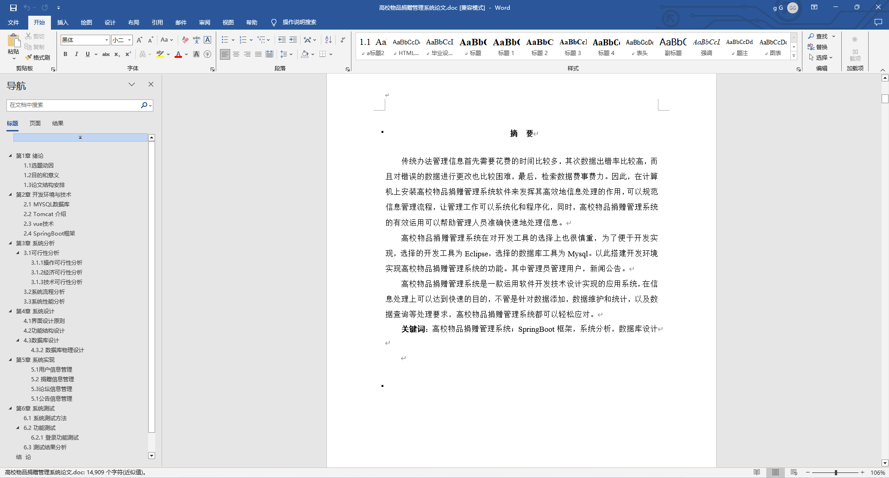
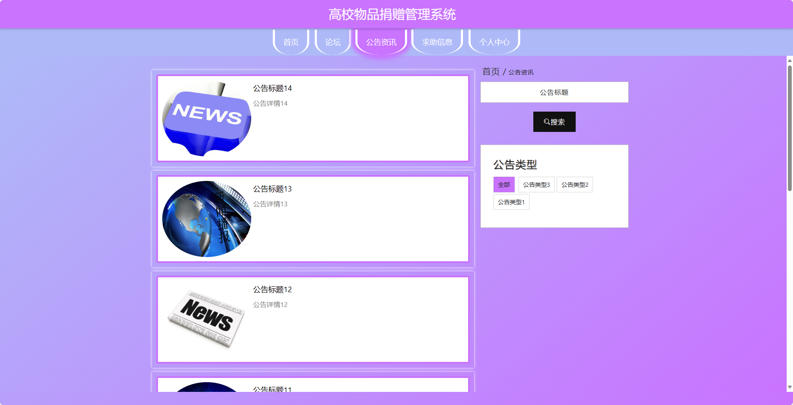
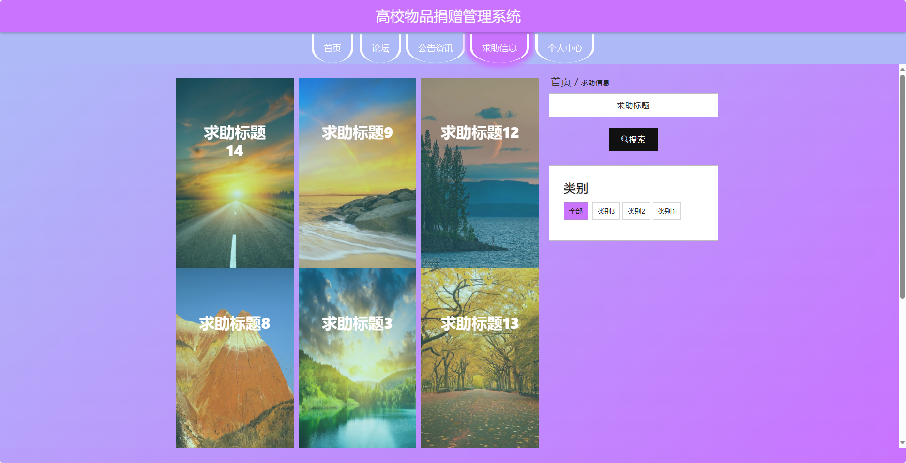
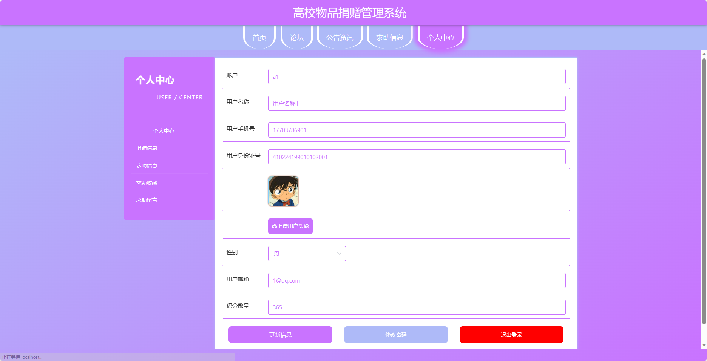
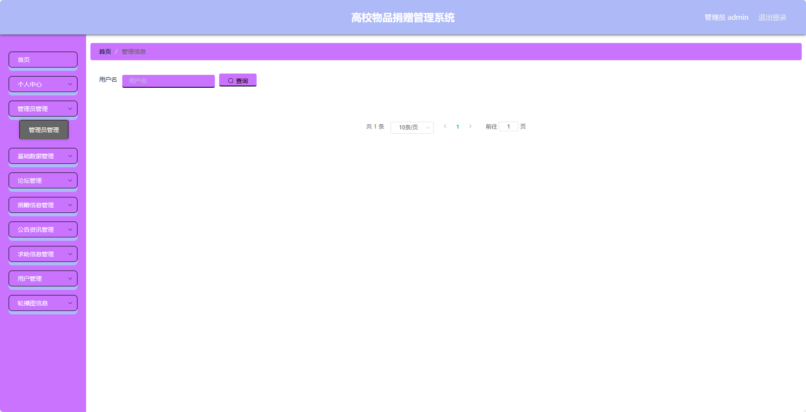
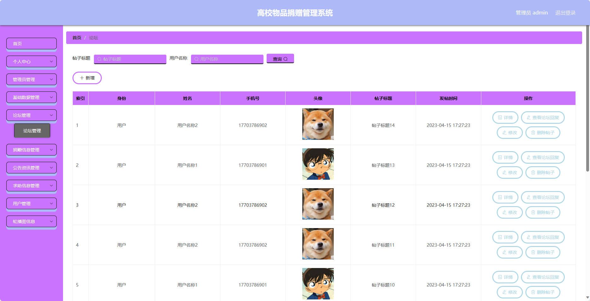
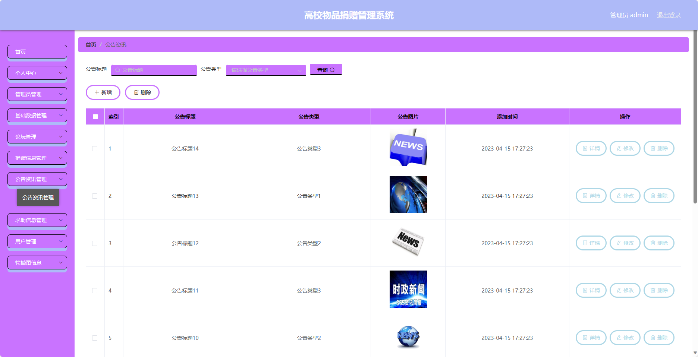
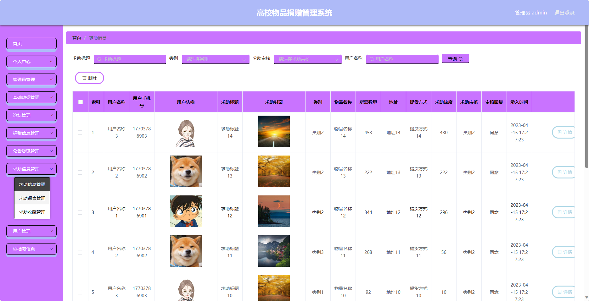

## 基于SpringBoot的高校物品捐赠管理系统(程序+报告)

###  获取sql数据库文件: 从戎源码网 (https://armycodes.com/) QQ: 386869957 QQ群: 377586148
###  所有系统地址: (https://github.com/YuLin-Coder/AllProjectCatalog) 
###  所有项目以及源代码本人均调试运行无问题 可支持远程安装部署调试、定制修改、代码讲解

## 项目介绍
基于SpringBoot的高校物品捐赠管理系统，系统包含两种角色：管理员、用户,系统分为前台和后台两大模块，主要功能如下。

### 【管理员】:
- 个人中心：管理个人信息。
- 管理员管理：管理系统管理员信息，包括添加管理员、编辑管理员、删除管理员等操作。
- 基础数据管理：管理系统的基础数据，包括物品分类、捐赠地点等数据的添加、编辑、删除等操作。
- 论坛管理：管理论坛相关内容，包括审核帖子、删除帖子等操作。
- 捐赠信息管理：管理捐赠信息，包括发布捐赠信息、编辑捐赠信息、删除捐赠信息等操作。
- 公告资讯管理：管理系统公告信息，包括发布和管理公告信息等操作。
- 求助信息管理：管理用户发布的求助信息，包括审核求助信息、删除求助信息等操作。
- 用户管理：管理系统用户信息，包括查看用户列表、禁用用户等操作。
- 轮播图信息：管理首页轮播图信息，包括添加轮播图、编辑轮播图、删除轮播图等操作。

### 【前台】:
- 首页：展示系统的概览信息、热门捐赠项目等内容。
- 论坛：供用户进行交流、分享心得、提问等活动。
- 公告资讯：查看系统发布的公告和相关资讯。
- 求助信息：浏览用户发布的求助信息。
- 个人中心：管理个人信息，包括查看个人捐赠记录、修改个人信息等操作。

## 项目技术
- 编程语言：Java
- 数据库：MySQL
- 项目管理工具：Maven
- 前端技术：HTML、CSS、JavaScript、Jquery、Vue
- 后端技术：Spring、SpringMVC、MyBatis

## 运行环境
- JDK版本：JDK1.8及以上
- 开发工具：IDEA、Ecplise、Myecplise都可以
- 数据库: MySQL5.7及以上
- Maven：maven3.0及以上
- Node：14.14.0及以上

## 运行截图

